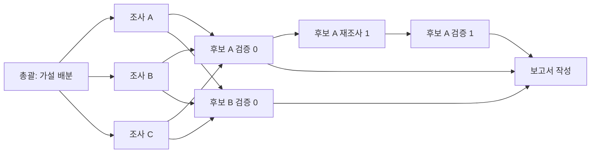

# 에이전트 액티비티 스트림 FE 인계

작성일: 2026-09-10

기존 `GET /api/runs/{run_id}/events`에 `agent_activity` 이벤트를 추가했습니다.
`mode=gemini`와 `mode=bedrock`의 실제 역할 실행과 모델, 도구 호출을 전달합니다.
Run 생성 요청, 202 응답, 기존 이벤트와 최종 보고서 계약은 유지합니다.
Fixture의 기존 분석 루프에는 멀티에이전트 액티비티가 발생하지 않습니다.

## 연결 순서

1. 기존 `POST /api/runs?mode=bedrock` 또는 `mode=gemini`로 분석을 생성합니다.
2. 202 응답의 `events_url`을 구독합니다.
3. `agent_activity`를 받아 `node_id`별 최신 상태를 저장합니다.
4. `depends_on`으로 실행 순서의 화살표를, `parent_node_id`로 역할 내부의 호출 목록을 표시합니다.
5. 최종 보고서는 기존 `result`로 갱신하고, `done`을 받으면 연결을 종료합니다.

`agent_activity.status=failed`는 개별 호출의 실패입니다. 도구 인자 수정, 모델 폴백,
부분 조사 결과를 이용한 보고가 뒤이어 실행될 수 있습니다. 이 값으로 Run을 종료하면 안 됩니다.
Run의 종료 상태는 기존 `done.payload.status`를 따릅니다.

## 토폴로지



조사는 실제 배분된 1~3개 가설에 따라 동적으로 생깁니다. 검증은 후보별로 분리하며
최대 6개를 병렬 실행합니다. 재조사는 그 후보를 판정한 검증 노드에 연결하고,
보고서는 실행된 모든 검증 노드에 연결합니다. 후보가 없으면 검증을 건너뛸 수 있습니다.
재조사는 여러 회차로 이어질 수 있으며, 변경된 후보만 다시 검증합니다.
미리 고정한 노드 수나 가상 퍼센트로 전체 진행률을 계산하면 안 됩니다.

| 필드 | 화면 매핑과 의미 |
| --- | --- |
| `schema_version` | 현재 `1` |
| `node_id` | 노드의 유일한 키. 같은 실행의 시작과 종료에서 동일한 값 |
| `parent_node_id` | 모델, 도구, 서버 판정이 속한 역할 노드. 역할 자체는 `null` |
| `depends_on` | 선행 역할 노드 ID 목록. 여러 조사에서 검증으로 합류하는 관계 포함 |
| `kind` | `agent`, `model`, `tool`, `assessment` |
| `role` | `coordinator`, `investigator`, `verifier`, `reporter` |
| `task_id` | 실제 에이전트 작업 ID. Langfuse의 작업 ID와 연결 |
| `round_index` | 최초 `0`, 재조사와 재검증에서 증가 |
| `status` | `queued`, `started`, `completed`, `failed`, `cancelled` |
| `name` | 역할 이름, 모델 호출의 `generation`, 실제 도구 이름, 서버의 `verification_policy` |
| `display_text` | 화면에 표시할 한국어 작업 설명 또는 공개 결과 요약 |
| `occurred_at` | 이벤트 발생 시각, UTC ISO 8601 |
| `duration_ms` | 시작부터 종료까지의 실제 경과 시간. 시작 전과 판정 이벤트는 `null` |
| `model` | 개별 모델 호출이 사용한 모델 ID. 다른 종류는 `null` |
| `details` | 아래에 정의한 실제 실행 결과의 공개 필드 |

역할은 `queued → started → completed/failed/cancelled`로 진행합니다.
모델과 도구는 `started → completed/failed/cancelled`로 진행합니다.
`assessment`는 서버 검사를 마친 시점의 `completed` 한 건입니다.
`cancelled`에는 역할 시간 제한에 따른 중단도 포함합니다.

`queued`는 실행 준비가 된 역할의 등록 시점입니다. 총괄 모델이 가설을 배분하기 전에는
조사 노드가 존재하지 않습니다. 같은 회차의 조사 노드는 병렬로 실행되므로 도착 순서가 달라질 수 있습니다.
모델과 도구는 역할 아래의 형제 노드이며, 호출별 세부 순서는 SSE `id`로 확인합니다.
검증 도구 `read_query_result`와 `recheck_candidate`는 각각 `질의 결과 추가 조회`와
`후보 근거 재검증`으로 표시합니다. 다른 도구와 같은 응답에서 제출한 `finish`는
실패 이벤트를 남깁니다. 모델이 도구 결과를 읽고 다음 응답에서 단독 제출하면 완료할 수 있습니다.

## 상세 값

`details`는 명시한 필드만 받는 Pydantic 모델입니다. 값이 없는 단일 필드는 `null`,
`candidates`, `decisions`, `limitations`는 빈 배열입니다.

| 내용 | 필드 | 주의점 |
| --- | --- | --- |
| 질의 결과 | `query_id`, `row_count`, `truncated` | `row_count`는 전체 결과 행 수. 고객 수와 동일하지 않을 수 있음 |
| 데이터 목록 | `table_count`, `event_count`, `customer_count` | 현재 Run에 허용된 데이터 공간의 실제 집계 |
| 고객 여정 조회 | `event_count` | 도구가 반환한 여정 이벤트 수 |
| 기존 패턴 조회 | `item_count` | 조회한 패턴 수 |
| 측정과 제안 | `measurement_id`, `candidate_id` | 실제 도구가 생성하거나 연결한 참조 |
| 모델 호출 | `tool_count`, `input_tokens`, `output_tokens` | 토큰 수는 provider가 반환한 경우만 제공 |
| 조사 결과 제출 | `candidates` | 후보 ID, 제목, cohort 질의 ID, 근거 질의 ID |
| 서버 검사 후 판정 | `decisions` | 후보 ID, 판정, 이유, cohort/근거 질의 ID, 재조사 질문 |
| 한계와 실패 | `limitations`, `error_code` | 공개 한계와 고정 오류 코드 |

조사 역할이 제출한 `candidates`는 검증 전 후보입니다. 확정된 결과처럼 표시하면 안 됩니다.
검증 모델이 반환한 판정도 서버 검사 전에는 공개하지 않습니다.
`kind=assessment`의 `decisions`에는 서버가 직접 질의 여부, 대표 여정 확인,
독립 재측정을 검사하고 필요하면 `candidate`로 낮춘 결과가 들어갑니다.
재검증이 발생하면 같은 `candidate_id`의 최신 판정으로 갱신합니다.
최종 수치와 확정 결과의 기준은 기존 `result.report`입니다.

역할의 모델 응답에는 선택 필드 `display_summary`를 추가했습니다.
모델이 한국어 500자 이내로 수행 내용과 관찰 결과를 작성하면 종료 이벤트의 `display_text`로 전달합니다.
필드가 없는 기존 모델 응답도 동작하며, 이때 기존 `summary` 또는 서버의 작업 설명을 사용합니다.
이는 역할 완료 시점의 공개 요약입니다. 토큰 단위 응답 스트리밍은 추가하지 않았습니다.

SQL 원문, 질의 결과 행, 고객 ID 목록, 프롬프트, provider 원문과 비공개 추론은 이 이벤트에
포함하지 않습니다. 질의 상세가 필요하면 서버 측 감사 파일이나 허용된 관측 화면에서 확인합니다.
FE는 `display_text`를 일반 텍스트로 렌더링해야 합니다.

## SSE 예시와 상태 갱신

다음은 형식 설명을 위한 예시이며 실제 노드 ID와 시각은 실행마다 달라집니다.

```text
id: 12
event: agent_activity
data: {"run_id":"<run UUID>","type":"agent_activity","payload":{"schema_version":1,"node_id":"tool-example","parent_node_id":"agent-example","depends_on":[],"kind":"tool","role":"investigator","task_id":"task-search","round_index":0,"status":"completed","name":"query_data","display_text":"데이터 질의","occurred_at":"2026-09-10T08:00:00Z","duration_ms":24,"model":null,"details":{"query_id":"query-example","row_count":120,"truncated":true,"candidates":[],"decisions":[],"limitations":[]}}}

```

다음 코드는 기존 `RunClient`가 디코딩한 이벤트를 받는 경우입니다.
직접 SSE를 파싱한다면 `event.data` 대신 JSON 봉투의 `payload`를 사용합니다.

```ts
const nodes = new Map<string, AgentActivity>();
let lastEventId = 0;

for await (const event of client.streamRunEvents(runId, { lastEventId })) {
  if (event.id <= lastEventId) continue;
  if (event.type === "agent_activity") {
    nodes.set(event.data.node_id, event.data);
    // depends_on: 실행 순서, parent_node_id: 역할별 상세 호출 묶음
  }
  lastEventId = event.id;
  if (event.type === "done") break;
}
```

시작 시각을 별도로 표시하려면 최초 `started.occurred_at`도 저장합니다.
지속 시간은 최종 `duration_ms`를 사용합니다. 장시간 호출 중에는 경과 시간을 표시할 수 있지만,
백엔드가 추가 진행 이벤트를 보낸 것처럼 타임라인을 만들면 안 됩니다.

재접속 시 마지막으로 처리한 SSE `id`를 `Last-Event-ID` 헤더로 전송합니다.
기존 클라이언트의 `lastEventId` 옵션이 이 헤더를 설정합니다.
새로고침으로 노드 상태가 사라졌다면 커서 `0` 또는 헤더 생략으로 전체 이력을 재생해야 합니다.
숫자 커서만 저장하고 노드 상태 없이 그 이후부터 구독하면 앞선 토폴로지가 누락됩니다.
완료된 Run은 Backend 재시작 후에도 journal에서 같은 이벤트와 커서를 복원합니다.
강제 종료된 실행은 재개하지 않습니다. 종료 이벤트가 없는 활동은 복원된 Run의 실패 상태에 맞춰
중단된 것으로 표시해야 합니다.

## 수정 파일과 FE 구현 범위

| 파일 | 역할 |
| --- | --- |
| `backend/src/customer_signal/investigation/activity.py` | 공개 이벤트 모델, 호출별 계측, 서버 판정 투영 |
| `backend/src/customer_signal/investigation/runner.py` | 역할 의존 관계와 회차, 시작과 종료 연결 |
| `backend/src/customer_signal/investigation/model.py` | Gemini/Bedrock 모델과 도구의 실제 호출 계측 |
| `backend/src/customer_signal/runtime/events.py` | 공개 SSE 타입과 봉투 스키마 |
| `backend/src/customer_signal/packs/customer_signal.py` | 기존 Canonical Event journal에 기록 |
| `backend/src/customer_signal/runtime/wire_projection.py` | 라이브와 재시작 재생에 같은 이벤트 투영 |
| `frontend/src/features/customer-intelligence/agent-activity.ts` | FE 타입과 디코더 |
| `frontend/src/features/customer-intelligence/run-client.ts` | 기존 스트림 구독에서 새 이벤트 수신 |
| `frontend/src/features/customer-intelligence/AgentTrace.tsx` | 기존 타임라인에 공개 설명과 호출 상태 표시 |

기존 FE reducer는 액티비티를 `events`에 보존합니다. `signal-catcher`의 동적 그래프는
단계와 로그 건수로 구성하므로 실제 역할 액티비티 연결은 FE 후속 구현 범위입니다.
후보별 검증과 재조사 연결에는 서버가 보낸 `depends_on`을 사용하며,
노드 도착 순서로 부모를 추정하면 안 됩니다.
기존 `step_started/completed`는 Fact 투영 단계이므로 실제 조사 시간에는 `agent_activity`를 사용합니다.
Swagger `/docs`의 SSE 응답에는 `RunEventEnvelope`, `AgentActivityPayload`, `ActivityDetails` 스키마를 노출합니다.

## 로컬 Langfuse

Backend `.env`의 키가 보는 프로젝트는 `demo-1`입니다.
프로젝트 ID는 `cmt84iujl0007qs077zcxunel`, 서버는 [로컬 Langfuse](http://localhost:3100)입니다.
로컬 `~/.codex/config.toml`의 `mcp_servers.langfuse_local.env`가 다른 프로젝트를 보고 있어
`LANGFUSE_PUBLIC_KEY`, `LANGFUSE_SECRET_KEY`, `LANGFUSE_BASE_URL`을 이 Backend 설정과 맞췄습니다.
변경 후 프로젝트 조회 API가 `demo-1`을 반환하는 것을 확인했습니다.
로컬 8000번 Backend도 기존 모델과 Source 디렉터리 설정을 유지해 재시작했고, 새 액티비티 Swagger 스키마 노출을 확인했습니다.
이미 실행 중인 MCP 프로세스에는 재연결 또는 Codex 재시작 후 새 설정이 적용됩니다.

관측 연결 키는 Run UUID에서 하이픈을 제거한 trace ID와 `role`, `task_id`, `round_index`입니다.
SSE의 `node_id`는 UI 노드 ID이며 Langfuse observation ID와는 다릅니다.
키 값은 FE나 인계 문서에 전달하지 않습니다. 환경 파일은 shell에서 source하지 않고
`scripts/dev.sh bedrock` 또는 `scripts/dev.sh gemini`로 Backend 시작 시 읽습니다.

## 검증

Backend 전체 회귀 테스트 882개, 액티비티 전용 테스트 7개, FE 테스트 97개가 통과했습니다.
전용 테스트에는 전체 회귀 실행 뒤 추가 검증한 병렬 부모 분리와 도구 인자 복구 사례가 포함됩니다.
FE 타입 검사, 변경 Python 파일의 Ruff 검사와 diff 공백 검사도 통과했습니다.

자동 검증은 병렬 실행의 부모 노드 분리, 재조사 의존 관계, 취소 시 종료 이벤트,
도구 인자 수정 전 실패 이벤트, 내부 원문 미노출, Swagger와 HTTP SSE를 포함합니다.
완료된 Run을 재시작한 Backend에서 전체 재생하고, `Last-Event-ID` 이후 이력이 일치하는지도 검사합니다.

```bash
uv run --project backend pytest -c backend/pyproject.toml backend/tests
cd frontend
npm test -- --run
npm run typecheck
```

실제 Bedrock 모델로 합성 데이터 목록을 조회하고 `finish`를 호출한 검증 Run은
`1618d8df-901d-407e-979f-60b800a0543c`입니다.
액티비티 이벤트는 역할 3개, 모델 4개, 도구 4개로 총 11개입니다.
Langfuse에서 부모를 포함한 AGENT 2개, GENERATION 2개, TOOL 2개를 확인했습니다.
이는 실제 모델 역할 1개의 관측 검증이며, 전체 조사 토폴로지는 자동 테스트에서 검증했습니다.
재현 스크립트는 `scripts/verify-agent-activity-live.py`이며 Backend와 같은 환경을 주입해 실행합니다.
