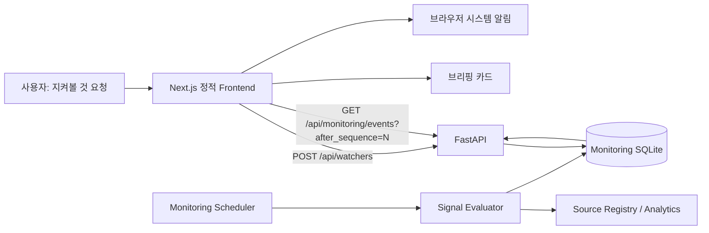
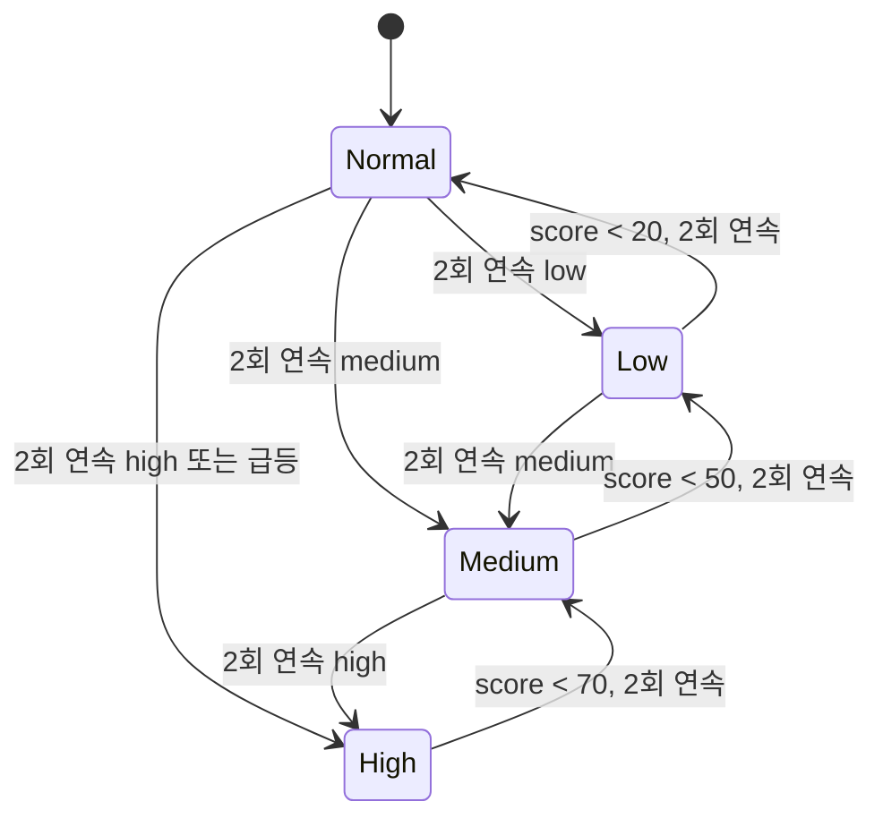

# 지속 관찰 시그널과 브라우저 탐지 알림 설계

- 상태: 구현 전 제안
- 기준일: 2026-09-10
- 대상: `SignalCatcherApp`의 브리핑과 `지켜볼 것 요청하기`
- 전제: 로컬 Backend(`127.0.0.1:8000`)와 로컬 Frontend(`127.0.0.1:3000`)가 실행 중이고, 사용자가 브라우저 탭을 열어 둔다.

---

## 1. 결정 요약

사용자가 요청한 대상을 Backend가 지속적으로 관찰하고, 탐지 결과를 내구성 있는 이벤트로
저장한다. Frontend는 짧은 주기로 새 이벤트를 폴링하고 다음 두 가지를 수행한다.

1. 브리핑 카드와 관찰 상태를 갱신한다.
2. 수위가 의미 있게 상승하거나 정상화된 이벤트를 브라우저 시스템 알림으로 표시한다.



여기서 **Frontend 폴링은 관찰을 수행하는 주체가 아니라 탐지 이벤트의 전달 경로**다.
탭이 백그라운드에 있으면 브라우저 타이머가 지연될 수 있으므로 데이터 조회, 점수 계산,
수위 판정, 중복 제거는 모두 Backend가 책임진다.

### MVP에서 보장하는 것

- Frontend 탭이 열려 있고 Backend가 실행 중이면 탐지 알림을 전달한다.
- 로컬 커서가 남아 있으면 새로고침과 일시적인 네트워크 단절 뒤에도 새 이벤트를 이어서 받는다.
- 같은 탐지 이벤트를 반복 폴링해도 알림은 한 번만 표시한다.
- `낮음`, `중간`, `높음` 수위와 `정상화` 상태를 브리핑에 표시한다.
- 일반 분석 Run의 SSE 계약은 변경하지 않는다.

### MVP에서 보장하지 않는 것

- 브라우저 또는 해당 탭을 완전히 종료한 동안의 즉시 알림
- Mac 절전 상태에서 정해진 시각 안에 알림 도착
- Backend가 종료된 동안의 관찰
- 여러 Backend 인스턴스에서의 분산 스케줄링
- 임의의 자연어 요청을 항상 실행 가능한 관찰 규칙으로 변환하는 것

브라우저가 닫힌 뒤에도 즉시 알림이 필요해지면 이후 Web Push 또는 macOS Companion을
Alert Router 뒤에 추가한다. 탐지와 이벤트 계약은 그대로 재사용한다.

---

## 2. 현재 코드와의 접점

### Frontend

- Next.js App Router지만 `output: "export"`인 정적 앱이다. Route Handler나 Server
  Action을 추가하지 않고 브라우저가 FastAPI를 직접 호출한다.
- `SignalCatcherApp.tsx`의 `watchRequests`는 현재 컴포넌트 메모리에만 존재한다.
  새로고침하면 사라지며 Backend 요청은 발생하지 않는다.
- `BriefingScreen.tsx`는 `onRequestWatch(request: string)`을 이미 제공한다.
- `briefing/briefing-mock.ts`의 `DEMO_BRIEFING`이 카드 두 장을 고정으로 채운다.
- `briefing/types.ts`에는 수위, 탐지 시각, 관찰 상태, 연결된 Run 정보가 없다.

### Backend

- FastAPI 엔드포인트는 `backend/src/customer_signal/api.py`에서 선언한다.
- CORS는 기본적으로 `http://127.0.0.1:3000`만 허용한다.
- 기존 `SQLiteEventJournal`은 **한 분석 Run 내부의 연속 이벤트**를 저장하며 Run의
  terminal 이벤트에서 스트림이 끝난다.
- 지속 관찰은 종료되지 않는 수명 주기이고 여러 Watcher의 이벤트를 하나의 전역 커서로
  조회해야 하므로 기존 Run Journal에 섞지 않는다.
- 탐지로 상세 분석이 필요하면 기존 `POST /api/runs` 흐름을 실행하고 Monitoring Event에
  `run_id`를 연결한다.

### 새 모듈의 권장 위치

```text
backend/src/customer_signal/monitoring/
├── contracts.py       # Watcher, Evaluation, Event의 Pydantic 계약
├── store.py           # monitoring.sqlite3 저장소
├── evaluator.py       # 점수와 수위 판정
├── service.py         # 스케줄, 상태 전이, 이벤트 기록
└── fixtures.py        # 해커톤 결정론적 시나리오

frontend/src/features/signal-catcher/monitoring/
├── types.ts
├── monitoring-client.ts
├── notification.ts
├── use-monitoring-feed.ts
└── leader.ts          # P1: 여러 탭 중 폴링 리더 선출
```

`RunClient`는 분석 Run과 SSE에 특화되어 있으므로 억지로 확장하지 않고
`MonitoringClient`를 분리한다. API base URL 상수와 공통 오류 형태만 추출해 공유할 수 있다.

---

## 3. 도메인 모델

### 3.1 Watcher

사용자가 “무엇을 지켜볼지” 정의한 지속 관찰 단위다.

```ts
type WatcherStatus = "active" | "paused" | "unsupported";
type SignalLevel = "low" | "medium" | "high";

interface Watcher {
  watcher_id: string;
  request_text: string;
  status: WatcherStatus;
  enabled_sources: string[];
  cadence_seconds: number;
  notify_levels: SignalLevel[];
  compiled_rule: WatchRule | null;
  current_level: SignalLevel | null;
  current_score: number | null;
  last_evaluated_at: string | null;
  next_evaluation_at: string | null;
  created_at: string;
  updated_at: string;
}
```

`compiled_rule`은 사용자 문장을 실제 Analytics 호출로 옮긴 서버 내부 계약이다. P0에서는
검증된 템플릿만 지원한다. 알 수 없는 요청을 임의의 규칙으로 지어내지 않고
`unsupported`와 대안 문구를 반환한다.

해커톤용 초기 템플릿 예:

| 템플릿 | 요청 예 | 관찰 지표 |
| --- | --- | --- |
| `roaming_decision_delay` | 로밍을 오래 비교하고 가입하지 않는 고객 | 탐색 기간, 미가입률, 상담 전환 |
| `payment_limit_dropoff` | 소액결제 한도 변경 중 이탈 | 단계별 이탈률, 재시도, 상담 전환 |
| `repeated_inquiry_after_care` | 상담 뒤에도 같은 문의를 반복 | 반복 문의 고객 수와 반복 간격 |

### 3.2 Signal Evaluation

한 번의 관찰 결과다. 모든 평가를 알림으로 만들지 않고 추세와 상태 전이 판단에 사용한다.

```ts
interface SignalEvaluation {
  evaluation_id: string;
  watcher_id: string;
  window_start: string;
  window_end: string;
  score: number;                    // 0..100
  level: SignalLevel | null;        // null은 정상 범위
  metrics: BriefingMetric[];
  trend: number[];                  // 0..1 정규화
  evidence_ids: string[];
  evaluated_at: string;
}
```

### 3.3 Monitoring Event

Frontend가 폴링하는 불변 이벤트다. 전역 증가 `sequence`가 전달 커서다.

```ts
type MonitoringEventKind =
  | "signal_detected"
  | "level_changed"
  | "signal_recovered"
  | "watcher_failed";

interface MonitoringEvent {
  schema_version: 1;
  sequence: number;
  event_id: string;
  watcher_id: string;
  kind: MonitoringEventKind;
  previous_level: SignalLevel | null;
  current_level: SignalLevel | null;
  score: number | null;
  title: string;
  body: string;
  metrics: BriefingMetric[];
  trend: number[];
  evidence_note: string;
  run_id: string | null;
  occurred_at: string;
  notify: boolean;
}
```

- Frontend는 점수로 수위를 다시 계산하지 않는다.
- `notify`는 사용자 정책, 이벤트 종류, 수위를 반영한 서버의 최종 전달 판단이다.
- `sequence`는 timestamp가 아니다. 같은 밀리초에 생긴 이벤트도 빠짐없이 정렬한다.
- 이벤트 payload에는 원본 PII와 내부 추론을 넣지 않는다.

---

## 4. 수위와 탐지 규칙

초기 기본값은 다음과 같이 두되 템플릿별로 덮어쓸 수 있다.

| 점수 | 상태 | 브리핑 | 기본 시스템 알림 |
| ---: | --- | --- | --- |
| 0–29 | 정상 | 관찰 중으로만 표시 | 없음 |
| 30–59 | 낮음 | 카드 표시 | 없음 |
| 60–79 | 중간 | 카드와 인앱 배지 | 선택 사항 |
| 80–100 | 높음 | 카드 최상단 | 즉시 |

점수 하나만으로 알림을 만들면 경계값 근처에서 알림이 반복되므로 다음 규칙을 적용한다.

1. **연속 확인**: 일반 변화는 같은 수위가 2회 연속 관측되어야 확정한다.
2. **급등 예외**: 직전 점수보다 25점 이상 상승해 `high`에 도달하면 즉시 확정한다.
3. **히스테리시스**: `high`는 70 미만, `medium`은 50 미만, `low`는 20 미만이 되어야
   아래 상태로 내려간다.
4. **상태 전이 알림**: 동일 수위가 유지되는 동안 새 이벤트를 만들지 않는다.
5. **정상화**: 탐지 상태에서 정상으로 돌아오면 `signal_recovered`를 한 번 만든다.
6. **쿨다운**: 같은 Watcher의 동일 전이는 기본 30분 동안 재발행하지 않는다.
7. **근거 부족**: 평가에 필요한 Source가 없거나 지표가 유효하지 않으면 점수를 만들지
   않고 실패 횟수만 기록한다. 3회 연속 실패 시 `watcher_failed`를 만든다.

서버 내부 상태 전이는 다음과 같다.



P0에서는 수치가 검증된 결정론적 Analytics 결과로 산출되어야 한다. LLM은 요청을 템플릿에
매핑하거나 알림 설명을 다듬는 데만 쓰고, 점수와 수위를 직접 결정하지 않는다.

---

## 5. API 계약

새 태그 `monitoring`을 `_OPENAPI_TAGS`에 추가하고 모든 요청/응답을 Pydantic 모델로
노출한다. 실제 구현 시 이 문서와 `docs/api-endpoints.md`를 함께 갱신한다.

### 5.1 Watcher 생성

```http
POST /api/watchers
Content-Type: application/json
```

```json
{
  "request_text": "상담 뒤에도 같은 문의를 반복하는 고객을 지켜봐줘",
  "enabled_sources": ["search_history", "voc"],
  "cadence_seconds": 300,
  "notify_levels": ["high"]
}
```

응답은 `201 Created`와 `Watcher`다. 같은 `request_text`, Source, Rule 조합을 다시
보내면 기존 Watcher를 돌려주어 중복 생성을 막는다. 이를 위해 요청에
`Idempotency-Key` 헤더를 지원한다.

### 5.2 Watcher 목록과 상태 변경

| Method | 경로 | 목적 |
| --- | --- | --- |
| `GET` | `/api/watchers` | 전체 Watcher와 현재 상태 조회 |
| `PATCH` | `/api/watchers/{watcher_id}` | 일시정지, 재개, 주기와 알림 수위 변경 |
| `DELETE` | `/api/watchers/{watcher_id}` | P1. 기본은 이력 보존을 위한 soft delete |

### 5.3 최초 부트스트랩

```http
GET /api/monitoring/bootstrap
Cache-Control: no-store
```

```json
{
  "cursor": 184,
  "oldest_available_sequence": 101,
  "server_time": "2026-09-10T13:00:00+09:00",
  "recommended_poll_after_ms": 5000,
  "briefing": {
    "date_label": "9월 10일 목요일",
    "lede": "두 곳에서 고객이 *멈춰 서 있어요.*",
    "signals": [],
    "request_count": 2,
    "watching_count": 2,
    "past_dates": [],
    "backlog_count": 0,
    "ask_placeholder": "상담 뒤에도 같은 문의를 반복한 고객",
    "suggestions": []
  },
  "watchers": []
}
```

부트스트랩은 **현재 화면을 그리는 스냅샷**과 이벤트 로그의 최신·최초 보유 커서를 함께
준다. 처음 방문해 저장된 커서가 없으면 응답의 `cursor`부터 시작해 과거 시스템 알림을
재생하지 않는다. 저장된 커서가 보유 범위 안에 있으면 그 커서부터 이어 받아 탭이 새로고침된
짧은 사이에 생긴 이벤트도 놓치지 않는다. 저장된 커서가 보유 범위보다 오래됐으면 현재
스냅샷으로 재동기화하고 과거 알림은 재생하지 않는다.

### 5.4 새 이벤트 폴링

```http
GET /api/monitoring/events?after_sequence=184&limit=100
Cache-Control: no-store
```

```json
{
  "items": [
    {
      "schema_version": 1,
      "sequence": 185,
      "event_id": "01J...",
      "watcher_id": "watch-repeated-inquiry",
      "kind": "level_changed",
      "previous_level": "medium",
      "current_level": "high",
      "score": 84,
      "title": "반복 문의 시그널이 높아졌어요",
      "body": "상담 후 같은 문의를 반복한 고객이 기준선보다 42% 증가했습니다.",
      "metrics": [],
      "trend": [0.31, 0.38, 0.45, 0.62, 0.84],
      "evidence_note": "근거 2개 소스 · 검색 / VOC",
      "run_id": "optional-run-id",
      "occurred_at": "2026-09-10T13:00:03+09:00",
      "notify": true
    }
  ],
  "next_cursor": 185,
  "has_more": false,
  "server_time": "2026-09-10T13:00:05+09:00",
  "recommended_poll_after_ms": 5000
}
```

계약 규칙:

- `items`는 `sequence` 오름차순이다.
- 결과가 없어도 `200`과 빈 배열을 반환한다.
- `next_cursor`는 응답에 포함된 마지막 sequence이며 빈 배열이면 요청 커서와 같다.
- `has_more=true`면 Frontend는 대기하지 않고 다음 페이지를 즉시 요청한다.
- 알 수 없는 미래 커서는 `400`, 보존 기간이 지나 만료된 커서는 `410`을 반환한다.
- `410`을 받은 Frontend는 부트스트랩을 다시 받고 과거 이벤트를 알림으로 재생하지 않는다.
- 이벤트는 최소 7일 보관한다. 브리핑 스냅샷과 Watcher 이력은 별도 정책으로 보관한다.

### 5.5 읽음 확인

P1에서 인앱 읽음 상태가 필요할 때만 추가한다.

```http
POST /api/monitoring/events/{event_id}/ack
```

브라우저 알림의 정확한 노출 성공 여부는 Web API가 신뢰성 있게 보장하지 않으므로 이 API는
“사용자가 카드나 알림을 열었다”는 명시적 확인만 기록한다. 폴링 커서와 읽음 상태는 서로
다른 개념이다.

---

## 6. Backend 처리 흐름

### 6.1 스케줄러

FastAPI lifespan에서 `MonitoringService`의 백그라운드 Task 하나를 시작하고 종료 시
cancel과 저장소 close를 기다린다.

```text
30초마다 due Watcher 조회
  → next_evaluation_at이 지난 active Watcher claim
  → Evaluator 실행
  → Evaluation 저장
  → 이전 확정 상태와 비교
  → 변화가 있으면 Monitoring Event 저장
  → Watcher 현재 상태와 next_evaluation_at 갱신
```

MVP는 Backend 단일 프로세스를 전제로 한다. 같은 Watcher 평가가 겹치지 않도록
`evaluation_started_at`과 `lease_until`을 원자적으로 갱신한다. 프로세스가 죽어 lease가
남아도 만료 후 다시 평가할 수 있어야 한다.

Frontend 폴링 요청이 평가를 직접 실행해서는 안 된다. 여러 탭이 같은 endpoint를 호출하면
평가와 비용이 중복되고 GET 요청에 쓰기 부작용이 생기기 때문이다.

### 6.2 평가와 상세 Run의 관계

지속 관찰의 모든 주기에 전체 LLM 분석을 실행하지 않는다.

```text
가벼운 결정론적 지표 평가
  ├─ 상태 유지 → Evaluation만 저장
  └─ 상태 변화 후보
       → 필요 시 기존 Analysis Run 실행
       → 검증된 Fact와 요약 연결
       → Monitoring Event 확정
```

해커톤 P0에서는 정해진 템플릿의 Analytics만 실행한다. `run_id` 연결은 선택 사항이며,
연결된 경우 브리핑의 “이 시그널 확인하기”가 기존 result/trace 흐름으로 진입한다.

### 6.3 저장소

`artifact_directory/monitoring.sqlite3`을 별도로 만들고 WAL을 사용한다. 최소 테이블은 다음과
같다.

| 테이블 | 역할 | 핵심 키 |
| --- | --- | --- |
| `monitoring_watchers` | 요청, 컴파일된 Rule, 현재 확정 상태 | `watcher_id` |
| `monitoring_evaluations` | 매 관찰의 점수와 지표 | `evaluation_id`, `(watcher_id, evaluated_at)` |
| `monitoring_events` | Frontend 전달용 불변 이벤트 | 전역 `sequence`, unique `event_id` |
| `monitoring_acks` | P1 읽음 확인 | `(event_id, client_id)` |

상태 변경과 이벤트 insert는 한 SQLite transaction에서 처리한다. 이벤트 중복 방지용
`transition_key`를 다음 값의 안정적인 조합으로 만들고 unique constraint를 둔다.

```text
watcher_id + kind + previous_level + current_level + evaluation.window_end
```

---

## 7. Frontend 폴링 설계

### 7.1 생명 주기

`useMonitoringFeed()`가 앱 최상단에서 한 번만 동작한다.

1. `/api/monitoring/bootstrap`을 호출한다.
2. 받은 `briefing`과 `watchers`로 화면을 그린다.
3. 유효한 로컬 커서가 있으면 로컬 커서, 없으면 bootstrap의 최신 `cursor`부터 재귀
   `setTimeout` 폴링을 시작한다.
4. 이벤트를 순서대로 reducer에 적용한다.
5. `notify=true`인 이벤트만 브라우저 알림 후보로 전달한다.
6. 성공적으로 reducer에 반영한 뒤 커서를 `localStorage`에 기록한다.

`setInterval`은 사용하지 않는다. 이전 요청이 느릴 때 요청이 겹치지 않도록 응답 처리가
끝난 뒤 다음 `setTimeout`을 예약한다.

```ts
async function poll() {
  try {
    const page = await client.listEvents(cursor, abortController.signal);

    for (const event of page.items) {
      applyEvent(event);                 // sequence 순서 보장
      maybeShowNotification(event);      // event_id로 한 번만
      cursor = event.sequence;
      persistCursor(cursor);
    }

    schedule(page.has_more ? 0 : page.recommended_poll_after_ms);
  } catch (error) {
    schedule(nextBackoffWithJitter(error));
  }
}
```

### 7.2 폴링 주기와 장애 복구

| 상태 | 다음 요청 |
| --- | ---: |
| 화면 표시 중 | 기본 5초 |
| 탭 hidden | 기본 15초, 브라우저 지연 허용 |
| `has_more=true` | 즉시 |
| 네트워크 오류 1회 | 약 2초 |
| 연속 오류 | 5초 → 10초 → 최대 30초, ±20% jitter |
| `online` 이벤트 | 즉시 재시도 |

- 한 요청의 timeout은 8초로 두고 `AbortController`로 취소한다.
- 컴포넌트 unmount, Backend base URL 변경, 사용자 로그아웃 시 진행 중 요청을 취소한다.
- 성공 응답 한 번이면 backoff를 초기화한다.
- 연결 오류 중에도 기존 브리핑을 지우지 않고 `마지막 확인 N분 전`을 표시한다.
- Backend의 `server_time`과 클라이언트 시각 차이를 계산해 “방금” 표시의 기준으로 쓴다.

### 7.3 커서와 중복 제거

Frontend는 다음 세 겹으로 중복을 막는다.

1. 서버: `event_id`와 `transition_key` unique constraint
2. 폴러: `sequence <= currentCursor` 이벤트 무시
3. 알림: `last_notified_sequence`와 최근 `event_id`를 `localStorage`에 보관

커서는 이벤트를 화면 상태에 반영한 뒤 저장한다. 알림 API 호출이 실패하거나 권한이 없어도
커서는 전진한다. 그렇지 않으면 허용되지 않은 알림 때문에 같은 이벤트를 무한 재처리한다.
시스템 알림 직전 알림 커서를 저장해 재시작 후 중복을 우선 방지한다. 브라우저 Notification
API에는 서버와 합의하는 전달 확인이 없으므로 “정확히 한 번 노출”은 보장하지 않으며,
MVP 계약은 **중복을 억제하는 at-most-once best effort**다.

### 7.4 여러 탭

P0 데모는 탭 하나를 전제로 할 수 있다. P1에서는 같은 사이트 탭이 여러 개 열려도 시스템
알림이 한 번만 뜨게 한다.

- `Web Locks API`의 `signal-catcher-monitoring` lock을 가진 탭만 서버를 폴링한다.
- 리더 탭은 `BroadcastChannel("signal-catcher-monitoring")`으로 이벤트를 다른 탭에 전달한다.
- lock 미지원 환경은 `localStorage` lease를 fallback으로 사용한다.
- 리더 탭이 닫히면 다른 탭이 lock을 얻고 저장된 커서부터 이어받는다.

---

## 8. 브라우저 알림 정책

알림 권한은 앱 진입 직후 자동 요청하지 않는다. 사용자가 브리핑의
`브라우저 알림 켜기` 버튼을 눌렀을 때만 `Notification.requestPermission()`을 호출한다.

| 권한 | UI |
| --- | --- |
| `default` | `브라우저 알림 켜기` 버튼 |
| `granted` | `이 탭에서 탐지 알림 수신 중` 상태 |
| `denied` | 브라우저 설정에서 허용하는 방법과 인앱 알림 유지 안내 |
| API 미지원 | 시스템 알림 없이 인앱 배지만 제공 |

```ts
new Notification(event.title, {
  body: event.body,
  tag: `signal-catcher:${event.watcher_id}`,
});
```

- `tag`는 같은 Watcher의 이전 알림을 교체해 알림 센터가 쌓이지 않게 한다.
- 기본 정책은 `high`, `watcher_failed`, `signal_recovered`만 시스템 알림으로 보낸다.
- `medium`은 사용자가 Watcher 설정에서 선택한 경우에만 보낸다.
- `low`는 브리핑 카드와 인앱 배지에만 표시한다.
- 현재 보고 있는 카드와 같은 이벤트라도 시스템 알림 정책은 유지한다. 사용자는 다른 앱을
  보고 있을 수 있기 때문이다.
- 알림 클릭 시 현재 창을 focus하고 `?view=result&run={run_id}` 또는 해당 브리핑 카드로
  이동한다. `run_id`가 없으면 카드까지만 연다.

화면에는 다음 상태 문구를 항상 노출한다.

> 이 브라우저 탭이 열려 있는 동안 5~15초 간격으로 새 시그널을 확인합니다.

이는 Web Push처럼 브라우저가 닫혀도 전달되는 기능으로 오해하지 않게 하는 제품 계약이다.

---

## 9. 브리핑 UI 매핑

기존 `BriefingSignal`을 다음처럼 확장한다.

```ts
interface BriefingSignal {
  // 기존 필드 유지
  id: string;
  name: string;
  headline: string;
  body: string;
  metrics: BriefingMetric[];
  trend: number[];
  evidenceNote: string;
  fromRequest: boolean;
  chipLabel: string;

  level: "low" | "medium" | "high";
  score: number;
  detectedAt: string;
  previousLevel: "low" | "medium" | "high" | null;
  watcherId: string;
  runId: string | null;
}
```

카드 정렬은 `high → medium → low`, 같은 수위 안에서는 `detectedAt` 최신순이다.

UI 변경:

- 카드 kicker에 `높음`, `중간`, `낮음` 수위 배지 추가
- `중간 → 높음`, `신규 탐지`, `정상화` 같은 상태 변화 표시
- 상단에 `마지막 확인`, `다음 확인`, `관찰 중 N건` 표시
- 연결 장애 시 녹색 pulse를 계속 보이지 않고 `확인 지연` 상태로 변경
- `지켜볼 것 요청하기` 제출 성공 시 로컬 배열 대신 `POST /api/watchers` 응답을 반영
- `unsupported` 응답이면 성공 문구 대신 지원 가능한 요청 예시를 표시
- `DEMO_BRIEFING`은 fixture Backend가 명시적으로 선택된 경우에만 사용하고, 실 API 실패를
  Mock 성공 화면으로 조용히 대체하지 않는다.

정상화된 시그널은 카드 덱에서 바로 삭제하지 않고 당일 브리핑 하단 `정상화됨` 영역에
남긴다. 사용자가 무엇이 해결됐는지 확인할 수 있어야 한다.

---

## 10. 보안과 개인정보

로컬 데모라도 브라우저에서 다른 로컬 서비스로 요청을 보내는 경계를 명확히 한다.

- Backend는 설정된 Frontend origin만 CORS 허용한다.
- 상태 변경 API는 `Origin`을 검사하고 JSON만 받는다.
- 알림과 브리핑에는 마스킹된 집계와 공개 Evidence ID만 포함한다.
- 고객 이름, 전화번호, 이메일, 원본 VOC 문장은 알림 body에 포함하지 않는다.
- `run_id`, `watcher_id`, `event_id`는 서버가 생성하며 파일 경로로 직접 사용하지 않는다.
- 상세 이동 URL은 서버 payload의 임의 URL을 열지 않고 FE가 허용된 route와 ID로 조립한다.
- 응답에는 `Cache-Control: no-store`를 설정한다.
- 운영 인증은 별도 과제다. 해커톤 로컬 모드는 loopback bind를 유지한다.

---

## 11. 관측 가능성

최소 다음 값을 구조화 로그와 `/health`의 세부 상태 또는 별도 진단 API에서 확인할 수 있어야
한다.

- 활성/일시정지/지원 불가 Watcher 수
- 마지막 Scheduler tick과 다음 예정 시각
- 평가 성공, 실패, 평균 소요 시간
- 마지막 Monitoring Event sequence
- Watcher별 최근 평가 시각과 연속 실패 횟수
- 폴링 요청 수와 반환 이벤트 수

LLM이나 Analytics Run을 실행한 경우 기존 LangSmith/Langfuse trace에는 공개 가능한
`watcher_id`, `evaluation_id`, `run_id`만 metadata로 연결한다. 원문 PII나 비공개 추론은
기록하지 않는다.

---

## 12. 실패 시나리오

| 상황 | 기대 동작 |
| --- | --- |
| Backend 일시 중단 | 기존 카드 유지, 연결 지연 표시, 지수 backoff |
| Backend 재시작 | SQLite 커서 이후 이벤트부터 계속 전달 |
| Frontend 새로고침 | bootstrap으로 현재 상태 복원, 과거 OS 알림 재생 금지 |
| 탭이 오래 hidden | 다시 visible이 되면 즉시 poll하고 누락 이벤트 순서대로 반영 |
| 이벤트 100건 초과 | `has_more` 페이지를 대기 없이 모두 drain |
| 만료 커서 | `410` 후 bootstrap 재동기화 |
| 알림 권한 거부 | 인앱 브리핑은 정상 동작, 권한 재요청 반복 금지 |
| 평가 Source 누락 | 근거 부족 기록, 기존 수위를 임의로 정상화하지 않음 |
| 동일 평가 재실행 | unique transition key로 이벤트 중복 방지 |
| 여러 탭 | P0는 중복 가능성을 명시, P1은 leader만 시스템 알림 |

---

## 13. 테스트 계획

### Backend

- Watcher 생성 idempotency와 Pydantic/OpenAPI 계약
- `normal → low → medium → high → recovered` 상태 전이
- 연속 확인, 급등, 히스테리시스, 쿨다운 경계값
- 평가와 이벤트 저장 transaction 원자성
- 서버 재시작 뒤 sequence 연속성과 스케줄 복구
- `after_sequence`, pagination, 빈 응답, 미래/만료 커서
- PII 및 금지 payload key가 이벤트에 들어가지 않는지
- 지원하지 않는 자연어 요청이 명시적으로 `unsupported`가 되는지

### Frontend Vitest

- bootstrap이 브리핑과 cursor를 초기화하는지
- 이벤트를 sequence 순으로 적용하고 중복을 무시하는지
- 요청 중첩 없이 재귀 polling하는지
- 오류 backoff와 성공 후 reset
- `has_more` 즉시 drain
- 권한별 알림 정책과 `event_id` 중복 방지
- Watcher 생성 성공/실패/unsupported UI
- P1 leader 변경 시 폴링과 BroadcastChannel 전달

### Playwright

1. fixture Backend로 브리핑 진입
2. `지켜볼 것 요청하기`로 Watcher 생성
3. 서버 fixture clock을 한 단계 진행
4. 10초 안에 카드 수위가 갱신되는지 확인
5. 알림 생성 함수가 한 번 호출되는지 확인
6. 새로고침 후 동일 이벤트가 다시 알림되지 않는지 확인
7. Backend 중단/재개 후 다음 이벤트가 유실되지 않는지 확인

실제 OS 알림 표시는 브라우저 자동화 환경에 의존하므로 E2E에서는 Notification adapter를
주입해 호출 계약까지 검증하고, macOS 수동 smoke를 별도 수행한다.

---

## 14. 구현 순서

### P0 — 해커톤 데모

1. Monitoring Pydantic 계약과 별도 SQLite Store
2. 템플릿 2~3개의 fixture Evaluator와 단일 프로세스 Scheduler
3. `POST /api/watchers`, bootstrap, events API와 Swagger 문서
4. `MonitoringClient`와 `useMonitoringFeed`
5. 브리핑 Mock을 bootstrap 응답으로 교체
6. 수위 배지, 마지막 확인 시각, 연결 지연 UI
7. 사용자 gesture 기반 Notification 권한과 `high` 알림
8. Backend/Frontend 단위 테스트와 단일 탭 E2E

### P1 — 데모 안정화

1. 여러 탭 leader 선출과 BroadcastChannel
2. pause/resume, 알림 수위 설정, 정상화 목록
3. 기존 Analysis Run 연결과 결과 화면 deep link
4. ack와 지난 탐지 이력
5. 실제 Source 기반 결정론적 Evaluator

### P2 — 제품화 후보

1. 자연어 Watch Rule compiler와 사용자 확인 단계
2. Web Push 또는 macOS Companion Alert Router
3. 여러 Backend 인스턴스용 분산 lease
4. 사용자 인증, tenant 분리, 보존 정책

---

## 15. 완료 기준

다음을 모두 만족하면 P0가 완료된 것으로 본다.

- 사용자가 만든 Watcher가 새로고침과 Backend 재시작 뒤에도 남아 있다.
- Backend가 새 `high` 이벤트를 저장하면 foreground 탭에서 목표 10초 이내에 카드와
  브라우저 알림이 갱신된다.
- 동일 이벤트는 반복 폴링, 새로고침, 일시 단절 뒤에도 한 번만 시스템 알림 후보가 된다.
- 동일 수위 유지 중에는 새 알림이 발생하지 않고 수위 상승과 정상화 때만 발생한다.
- Backend 연결이 끊기면 UI가 이를 숨기지 않고 마지막 성공 확인 시각을 표시한다.
- 알림 권한을 거부해도 지속 관찰과 브리핑은 계속 동작한다.
- 일반 분석 Run의 기존 SSE와 `/legacy` 화면이 회귀하지 않는다.
- 신규 API가 Swagger와 `docs/api-endpoints.md`에 함께 반영된다.

---

## 16. 열린 결정

구현 전에 제품 소유자가 다음 네 가지만 확정하면 된다.

1. 기본 시스템 알림을 `high`만 보낼지 `medium`부터 보낼지
2. 실제 관찰 주기: 데모 30초/1분, 일반 사용 5분/1시간/하루 중 무엇인지
3. Watcher 생성 시 지원하지 않는 자연어를 거절할지, 초안 Rule을 보여주고 확인받을지
4. 정상화 알림과 Watcher 실패 알림을 시스템 알림으로 보낼지

문서의 기본 결정은 **high 즉시 알림, medium 선택 알림, 5분 관찰, 지원하지 않는 요청은
명시적 거절, 정상화와 3회 연속 실패는 알림**이다.
